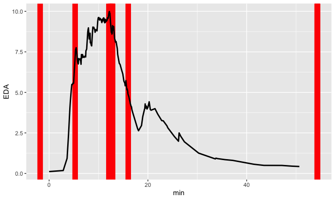

## Overview
### wearables
Functions for analyzing empatica e4 data, pre-process the signals, detect artifacts
and create several features for analysis.

We are working on functionality to also process Empatica EmbracePlus and Nowatch data.
These devices can be found here: 

https://www.empatica.com/embraceplus/
https://nowatch.com/

This package was originally created for signal analysis of the Empatica E4 wearables device. It allows
users to read in an E4 zip file from Empatica connect into a list.
The package was created to detect artifacts and extract features that can be used for 
analysis.


- 'read_e4()' is the first function that can be used to read Empatica E4 data into a list.
- 'read_and_process()' is a function to perform analyses on the heart rate, electrodermal activity, accelerometry and temperature data.


If you are new to Empatica E4, the best place to start is the [website from Empatica ](https://www.empatica.com/research/e4/) or the accompanying website for the [Shiny tool
](https://pcdlf.shinyapps.io/e4dashboard/).

[](https://github.com/PCdLf/wearables/actions)

## Installation

This package is available on [CRAN](https://cran.r-project.org/package=wearables):

``` r
#install the wearables package:
install.packages("wearables")
```

Or get the development version from GitHub:

```r
install.packages("remotes")
remotes::install_github("PCdLf/waiter")
```

## Getting started

Below are some instructions to get started with `wearables`, using example data from the E4.

You can get a small example dataset for the E4 by using `data(e4)`:

``` r
library(wearables)

# result would be equivalent to 
#e4_data <- read_e4("Your filepath to zip-file here")

data(e4_data)

```

Subsequently, you can process this data:

```r
processed_e4_data <- process_e4(e4_data)
```

#read_e4("Your filepath to zip-file here")
#read_and_process_e4("Your filepath to zip-file here")


This will do the following:

* Analyzing IBI data
* Filtering EDA data
* Peak detection
* Compute EDA Features
* Generate model predictions and classify artifacts

With this processed data, you can also plot the artifacts, using `eda_bin` and `eda_peaks` from the resulting object:

```r
plot_artifacts(processed_e4_data$eda_bin, processed_e4_data$eda_peaks)
```



## Getting help

If you encounter a clear bug, please file an issue with a minimal
reproducible example on
[GitHub](https://github.com/PCdLf/wearables/issues). 
